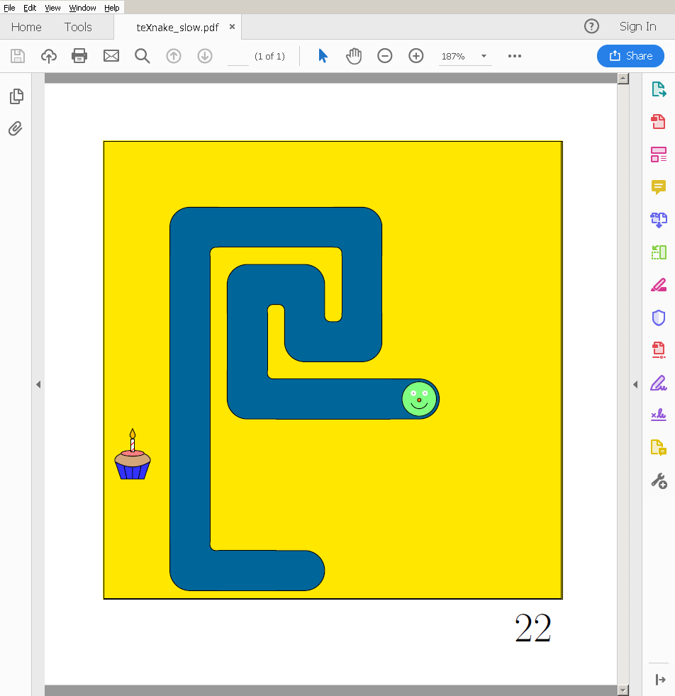

# teXnake
This is Snake, implemented in Latex and playable in a PDF viewer. Currently it only runs in Adobe Reader. On Linux in can be used through Wine.

Features:

- Keyboard controls
- Photorealistic snake facial expressions
- Cupcakes
- On a good day, the performance is ok

## Download
Compiled PDFs can be downloaded from the [releases section](https://github.com/fllor/teXnake/releases).

## Custom snake
The apperance of the snake can be customized through the file `draw_snake.tex`.

## License
teXnake is licensed under the GNU General Public License v3. 
